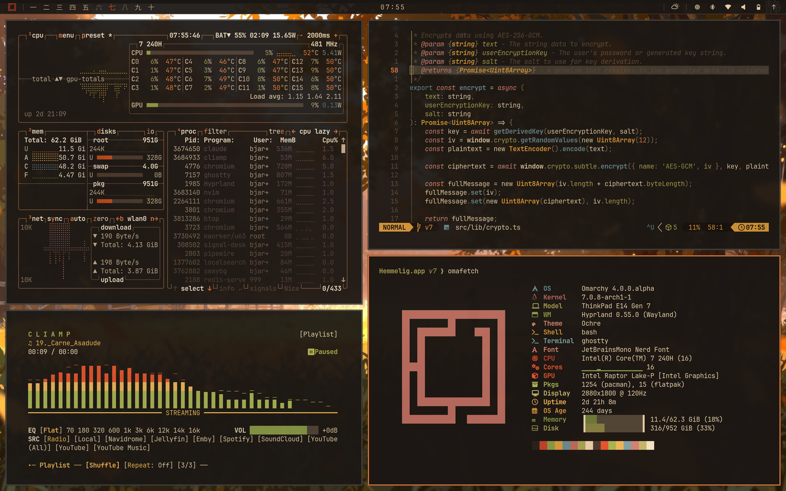

# Ochre Light

A light, autumn-toned theme for [Omarchy](https://github.com/basecamp/omarchy).

The light counterpart to [Ochre](https://github.com/bjarneo/omarchy-ochre-theme): same warm palette of rust, oxblood, olive, gold, and slate-blue, on a parchment background.

Prefer the dark original? See [Ochre](https://github.com/bjarneo/omarchy-ochre-theme).



## Installation

```sh
omarchy-theme-install https://github.com/bjarneo/omarchy-ochre-light-theme
```

## Author

[@iamdothash](https://x.com/iamdothash)
